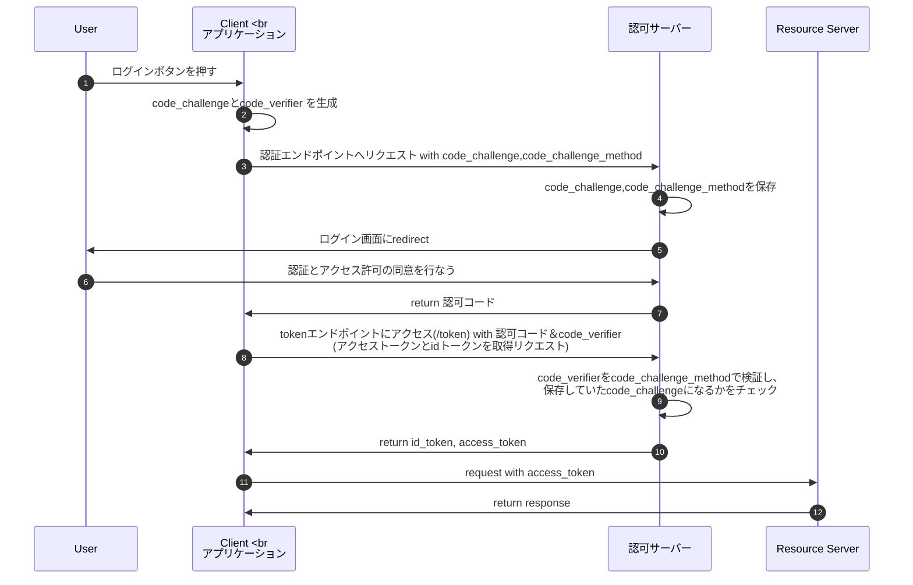

```mermaid

sequenceDiagram
    autonumber

    participant User as User
    participant Client as Client <br<br>アプリケーション
    participant AuthorizationServer as 認可サーバー
    participant ResourceServer as Resource Server

    User ->> Client: ログインボタンを押す
    Client ->> Client: code_challengeとcode_verifier を生成

    Client ->> AuthorizationServer: 認証エンドポイントへリクエスト with code_challenge,code_challenge_method
    AuthorizationServer ->> AuthorizationServer: code_challenge,code_challenge_methodを保存
    AuthorizationServer ->> User: ログイン画面にredirect
    User ->> AuthorizationServer: 認証とアクセス許可の同意を行なう
    AuthorizationServer ->>　Client: return 認可コード
    Client ->>　AuthorizationServer: tokenエンドポイントにアクセス(/token) with 認可コード＆code_verifier<br>(アクセストークンとidトークンを取得リクエスト)
    AuthorizationServer ->> AuthorizationServer: code_verifierをcode_challenge_methodで検証し、<br>保存していたcode_challengeになるかをチェック
    AuthorizationServer ->> Client: return id_token, access_token
    Client ->>　ResourceServer: request with access_token
    ResourceServer ->> Client: return response
```